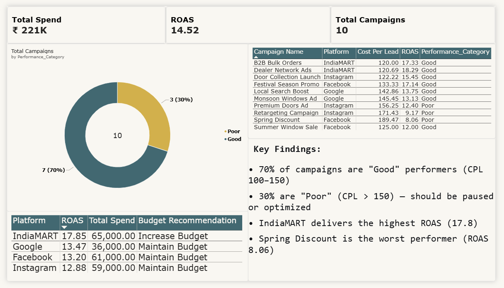

# Power BI Dashboard — Marketing Campaign ROI

Interactive 3-page dashboard analyzing digital marketing campaign performance across Facebook, Instagram, IndiaMART, and Google.

## 📊 Dashboard Pages

### Page 1 — Executive Overview


**Key metrics:**
- Total Spend: ₹221K INR
- Total Revenue: ₹3.21M INR
- Total Leads: 1,625
- ROAS: 14.52
- ROI: 1,352.49%

**Visuals:** ROAS by platform, campaign spend vs revenue scatter, cost per lead by campaign (sorted), and campaign performance table.

---

### Page 2 — Platform Deep Dive


**Key insights:**
- IndiaMART delivers the highest ROAS (17.85) but also the highest cost per lead.
- Facebook delivers strong volume at moderate cost.
- Instagram has the lowest ROAS (12.88) — opportunity for optimization.

**Visuals:** Platform metrics matrix, leads vs conversions comparison, monthly spend vs revenue trend.

---

### Page 3 — Campaign Efficiency


**Key insights:**
- 70% of campaigns are "Good" performers (CPL 100–150), 30% are "Poor" (CPL > 150).
- B2B Bulk Orders (IndiaMART) is the top-performing campaign (ROAS 17.33).
- Spring Discount (Facebook) is the worst performer (ROAS 8.06) — recommend pausing.

**Visuals:** Performance category distribution, detailed campaign ranking, platform budget recommendations, key findings.

---

## 🛠️ Built With

- **Power BI Desktop**
- **DAX** for measures (ROAS, ROI, Cost Per Lead, Budget Recommendation)
- **Power Query** for data cleaning (data types, trimming, removing blanks)

## 📁 Files in this Folder

| File | Description |
|------|-------------|
| `marketing_dashboard.pbix` | Source Power BI file |
| `page1_executive.png` | Executive Overview screenshot |
| `page2_platform.png` | Platform Deep Dive screenshot |
| `page3_campaigns.png` | Campaign Efficiency screenshot |

## 🔍 Key DAX Measures

```dax
Total Spend = SUM(campaigns[spend])
Total Revenue = SUM(campaigns[revenue])
Cost Per Lead = DIVIDE([Total Spend], [Total Leads])
Cost Per Acquisition = DIVIDE([Total Spend], [Total Conversions])
ROAS = DIVIDE([Total Revenue], [Total Spend])
ROI % = DIVIDE([Total Revenue] - [Total Spend], [Total Spend])
Budget Recommendation = 
SWITCH(TRUE(),
    [ROAS] > 15, "Increase Budget",
    [ROAS] >= 10, "Maintain Budget",
    "Reduce Budget"
)

👤 Author
Yusuf Baig — Aspiring Data Analyst | Open to roles in Dubai, UAE

LinkedIn: yusuf-baig-783906210

GitHub: @Yusufbaig2001

